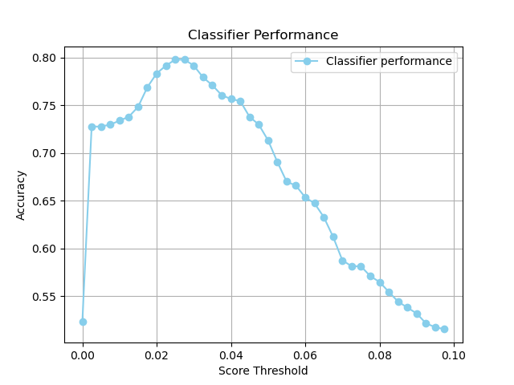

# Optimize the unique words classifier

As you saw in the previous part, for the file `shakespeare.0350.txt`, to be classified correctly, the threshold needs to be 0.05 or lower. But for other files the best threshold for correct classification might be different. In general, if we set the threshold too high the algorithm will be too strict and classify text fragments that are written by Shakespeare as being from another author (false negatives). But if we set the threshold too low, it will be too lenient and incorrectly classify text fragments written by other authors as written by Shakespeare (false positives).

So there must be some goldilocks setting for this threshold parameter. **Which threshold gives the highest accuracy?**

The end result of this part of the assignment should be a figure like this:

Here you can clearly see how the chosen threshold value influences the resulting score.

## Overview

This assignment requires some adaptations of the file `unique-word-classifier.py` (**Make sure to backup the previous one somewhere before continuing.**)

1. Obtain **all** files of the `test-set` folder (not just the sample one from previous assignment).
2. Determine the actual authorship information for **all** text fragments (to establish expected results).
3. **For each fragment**: predict whether it was written by Shakespeare, using a specified threshold.
4. **Determine the accuracy of the predictions.**
5. Iterate through these steps using various threshold values. Visualize the outcomes and determine the threshold that produces the most accurate classification.

### Step 1

Obtain **all** files of the `test-set` folder (not just the sample one from previous assignment).

The provided function `get_text_file_names('test-set')` will already give you this. It generates a list of all the files you need: `[WindowsPath('test-set/jonson.0009.txt'), WindowsPath('test-set/jonson.0010.txt'), ...]`. Store the result in a variable `text_file_names` and print it so you know it's getting the correct files.

### Step 2

You need to define a function called `compute_all_accuracies(thresholds, text_file_names, shakespeare_words)`, that will determines the accuracies of the algorithm given a list of `thresholds`. Example usage:

    thresholds = [0.0, 0.02, 0.04, 0.06, 0.08]
    accuracies = compute_all_accuracies(
        thresholds,
        text_file_names,
        shakespeare_words
    )

This should give a list of accuracy scores corresponding to running the list with the given thresholds:

    [0.5237113402061856, 0.7835051546391752, 0.756701030927835, 0.6536082474226804, 0.5649484536082474]

In this function:

* Determine the actual authorship information for **all** text fragments (to establish expected results).

  The function `is_written_by_shakespeare(file_name)`, already determines if a text file is written by Shakespeare, based on the filename. You can apply it to all elements of the list of filenames, generating a new list of booleans: `[False, False, ...]`, where `True` means the corresponding file is from Shakespeare and `False` means it's from a different writer.

* You can now use the function `calculate_shakespeare_score(text, shakspeare_words)` to compute for each text fragment the _Shakespeare score_. With the chosen threshold you can now predict for each file if it was or wasn't written by Shakespeare. This should also generate a list of booleans: `[False, True, ...]` where `True` means that the algorithm predicts that the corresponding file is written by Shakespeare and `False` means it isn't.

* In an ideal situation the list of booleans from the previous two steps are the same. That means that for every text fragment the actual authorship and the predicted one are the same, giving an accuracy of 1. In reality this will never be the case. The prediction will be never be perfect. If for example the actual values are:

      [False, False, ...]

  And the predicted values are:

      [False, True, ...]

  It means that the prediction of the second text fragment (`'jonson.0010.txt'`) is wrong. We predicted that it was written by Shakespeare, but in reality it wasn't.

  The accuracy is simply the amount of correct predictions divided by the total amount of predictions.

  It's best to create yet another function `calculate_accuracy(actual, predicted)` to compute the accuracy of the predictions.

#### Step 3

Once you have the function above working, use values between 0 and 0.1 in 40 steps for the thresholds and visualize the results to determine the optimal threshold.

## Test

    checkpy unique-word-classifier
