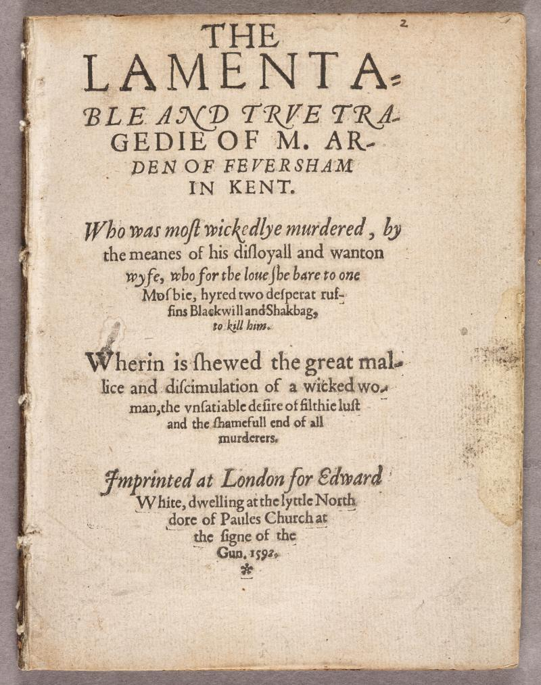

# Shakespeare

Was the play "Arden of Faversham" (1592) written by Shakespeare? A.C. Swinburne thought it was, but T.S. Eliot didn't. As it turns out, it might even be the case that some passages were written by Shakespeare and some by other authors. This is not the only text for which it is unclear if Shakespeare wrote it.

(source: [Shakespeare Documented](https://shakespearedocumented.folger.edu/resource/document/arden-faversham-first-edition))

Could we create a computer program that could settle the debate once and for all?

It turns out that the answer is: yes... maybe?

Hugh Craig and Arthur F. Kinney have attempted to do precisely this and have written an entire book on their findings: "Shakespeare by the Numbers: What Stylometrics Can and Cannot Tell Us." You might not immediately want to purchase and read a book on a subject that you might have only first heard of three paragraphs ago. However, if you are interested, the following book review provides a concise summary: [Review Craig & Kinney](https://shakespeareoxfordfellowship.org/shakespeare-by-the-numbers-what-stylometrics-can-and-cannot-tell-us/)

**The main question is: Is it possible to use a computer to predict whether a given text fragment is written by Shakespeare?**

The authors of the book describe their use of various techniques to characterize Shakespeare's writing style. Most of these techniques go beyond the scope of this course. However, we can explore whether a simpler approach might yield interesting results.

In this module, we will implement two distinct methods for determining whether a text was written by Shakespeare.

> Note: In the field of machine learning, such a problem is called as a _classification_ problem. Our goal is to categorize text fragments into two distinct classes: those belonging to the _class_ of fragments written by Shakespeare and those belonging to the _class_ of fragments _not_ written by Shakespeare.

Both approaches revolve around analyzing the vocabulary used.

For the first approach, we will compile a set of words that are characteristic of texts written by Shakespeare. For instance, 'Macbeth' might be a word exclusive to Shakespeare's usage, whereas the term 'speed' is likely used by many other writers. In this approach, we will classify text fragments by counting the number of these **unique** Shakespearean words they contain.

The second approach is somewhat similar but slightly more complex. Words will be assigned scores that indicate their relevance to Shakespearean writing. For instance, 'Macbeth' has a relatively high score of 0.017, suggesting a strong association with Shakespeare's writing (i.e., Shakespeare uses that word more frequently than other writers). On the other hand, 'speed' has a relatively low score of 0.003, suggesting that Shakespeare doesn't use that word more frequently than other writers. For the scores we use a metric called Term Frequency - Inverse Document Frequency (**TF-IDF**)

This implementation of both algorithm is split up in several phases:
- Algorithm 1 (unique words). You are provided with a list of words that are unique to Shakespeare and code that can classify a single document.
    - Optimize the provided code. The provided code is quite slow. Make sure it works fast enough to run on large datasets.
    - 
