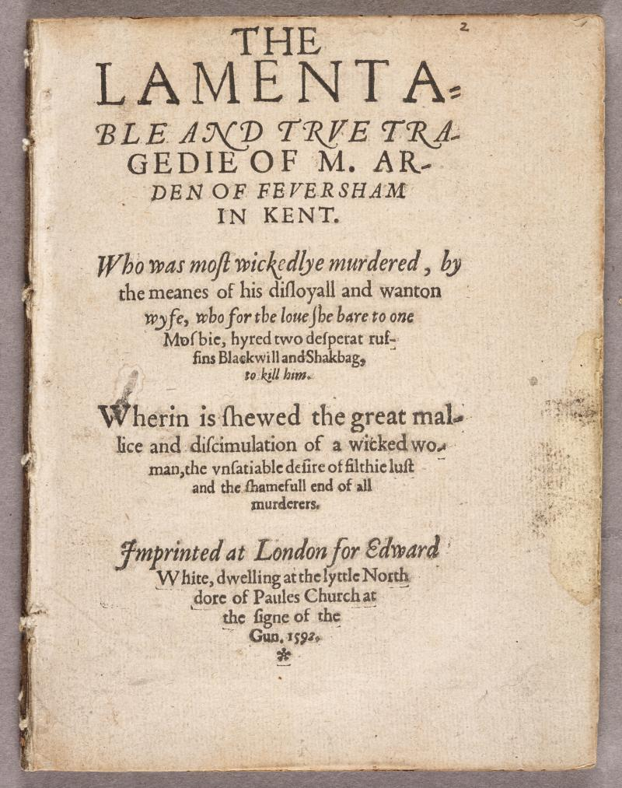

# Shakespeare

Was the play "Arden of Faversham" (1592) written by Shakespeare? A.C. Swinburne thought it was, but T.S. Eliot didn't. As it turns out, it might even be the case that some passages were written by Shakespeare and some by other authors. This is not the only text for which it is unclear if Shakespeare wrote it.

(source: [Shakespeare Documented](https://shakespearedocumented.folger.edu/resource/document/arden-faversham-first-edition))

Could we create a computer program that could settle the debate once and for all?

It turns out that the answer is: yes... maybe?

Hugh Craig and Arthur F. Kinney have attempted to do precisely this and have written an entire book on their findings: "Shakespeare by the Numbers: What Stylometrics Can and Cannot Tell Us." You might not immediately want to purchase and read a book on a subject that you might have only first heard of three paragraphs ago. However, if you are interested, the following book review provides a concise summary: [Review Craig & Kinney](https://shakespeareoxfordfellowship.org/shakespeare-by-the-numbers-what-stylometrics-can-and-cannot-tell-us/)

**The main question is: Is it possible to use a computer to predict whether a given text fragment is written by Shakespeare?**

The authors of the book describe their use of various techniques to characterize Shakespeare's writing style. Most of these techniques go beyond the scope of this course.

## Goal

For this module you're just going to dip your toes in the water: You're going create a vocabulary profile for Shakespeare texts. So, we want to create a list of scored words, where the score reflects how typical the word is for Shakespeare. The idea is that this list of scored words could then later be used to identify Shakespearean writing, but that's beyond the scope of this assignment.

### The data

You'll need to download the following two text fragments: [shakespeare-texts1.txt](shakespeare-texts1.txt) and [shakespeare-texts2.txt](shakespeare-texts2.txt). These two texts contain a lot of arbitrary text fragments of Shakespeare:

    Good gentleman, go your gait, and let poor volke pass. An chud ha’ bin zwaggered out of my life, ’twould not ha’ bin zo long as ’tis by a vortnight. Nay, come not near th’old man; keep out, che vor ye, or ise try whether your costard or my ballow be the harder: chill be plain with you.

    ...

You will also need to download [unigram.csv](unigram.csv). This is a csv-file containing 333.333 words from the English language and their frequency (given a specific data-set):

    the,23135851162
    of,13151942776
    and,12997637966

    ...

    gooblle,12711
    gollgo,12711
    golgw,12711

The goal is that given this data you want to compute scores that reflect how typical a score is for Shakespearean writing:

    mephistophilis,23.47
    launcelet,19.56
    æneas,15.65
    chooseth,11.74

    ...

    to,-7780.92
    of,-8685.74
    and,-11625.61
    the,-14325.99

### The program

You will need to do this in a couple of steps:

1. Tokenize each text file (convert into a list of cleaned-up lowercase words).
2. For each text file create a dictionary with the frequency of each word in the file. We call such a dictionary a bag of words (bow).
3. Merge the two bow-dictionaries into one.
4. Read the word frequencies from `unigram.csv` into a word frequency dictionary.
5. Use the bow and word frequency dictionary to create a dictionary containing the score for each word, using the metric described in the next section.
6. Sort the word scores and write to a file.

### The score

We want the final scores to reflect how typical the word is for Shakespeare. For example the word 'littlewit' is typical for Shakespearean texts as he uses it frequently, but it is not a common word in English, so this should receive a high score. Whereas 'table' should receive a low score, because even though Shakespeare has undoubtedly used this word frequently, it is not particularly unique to his works.

A metric called Term Frequency - Inverse Document Frequency (**TF-IDF**) perfectly captures these intuitions, but can not be directly applied to our case so we will create our own metric that is loosely based on TF-IDF.

The score will be based on how often the word appears in our sample texts (_count_) and the frequency of the word in the English language (_freq_) as given by `unigram.txt`. The score of the word is given by:

$$
\textrm{score}_\textrm{word} = \textrm{count}_\textrm{word} * ln(\frac{50}{\textrm{freq}_\textrm{word}})
$$

### Tokenizing

You can use the following function to tokenize the text from the text files:

    def tokenize_text(text):
        """
        Returns a list of words from string text.
        """
        words = []
        for word in text.split():
            clean = word.lower().strip(' ,;.:\'"-_?!\n')
            if clean.isalpha():
                words.append(clean)
        return words

### Requirements

* Your program should produce the following file: [scores.csv](scores.csv)
* It has to contain the following functions:
    * `read_bow(filename)`: Reads a text file given by `filename`, tokenize its contents, and builds a Bag-of-Words dictionary with keys being the words and the values being the number of times it appears in the file.
    * `merge(bow1, bow2)`: Merges two dictionaries by summing their values for matching keys. This function should be used to merge the Bag-of-Words dictionaries of both text files.
    * `read_unigram_csv(filename)`: Reads the CSV unigram file as provided by `filename` into a dictionary with keys being the words and values their frequency (as integer). The function converts each word to lowercase.
    * `scores(bow, freq)`: Calculates weighted scores for each token in a Bag-of-Words (BoW) dictionary provided the word frequencies `freq` as provided by `read_unigram_csv()`. It should use the score described above.

### Testing

Todo
