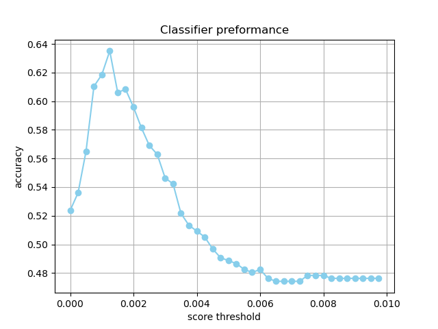

# Scored Shakespeare classifier

The previous classifier showed great performance despite its simplicity. However, it has some issues. For instance, consider the scenario where we incorporate a significantly greater number of text fragments written by many distinct writers. In such a case, we expect that as our dataset expands, the effectiveness of the initial approach would diminish. This is mostly due to the diminishing likelihood of encountering a word from the Shakespeare word list that does not appear in any of the other text fragments. **As the dataset grows in size, the collection of words uniquely attributed to Shakespeare's works would eventually become empty.**

Instead of the binary categorization of words of either being typical of Shakespearean language or not, let's introduce a scoring system. A higher score will indicate a stronger resemblance to Shakespearean writing. To achieve this, we can draw inspiration from search engines like Google. These search engines maintain records of a word's relevance to a specific website, using the resulting score to identify the most relevant documents for a given query. A widely-used scoring method for this purpose is Term Frequency-Inverse Document Frequency (TF-IDF). This metric effectively measures both a word's frequency of usage on a website and its uniqueness to that particular site (i.e., how uncommon the word is). For instance, the term "Shakespeare" would get a high score on this particular website due to its frequent occurrence and relative rarity as a word. Conversely, the word "a" would receive a low score since, despite its high frequency of use, it is extremely common and lacks distinctiveness that would characterize any specific website.

We can apply a similar approach to analyze text fragments and use TF-IDF to figure out how distinctive a word is in Shakespeare's writing.

Once we have these scores, we have various options to classify text fragments based on them. However, for this task, let's keep it simple: We'll just add up the scores for each word in the text portion to get the overall score of that part. Consider the following TF-IDF scores:

    thy, 0.058
    love, 0.046
    neighbor, 0
    and, 0
    cat, 0

Using these scores, the text fragment "Love thy neighbor and thy cat" receives a total score of $$0.046 + 0.058 + 0 + 0 + 0.058 + 0 = 0.162$$. It's important to note that (unlike the previous task), repeated occurrences of a word in the text portion are included in this calculation.

Once we establish a score for a text fragment, we can use the same method as before by using a specific threshold to determine whether the text was written by Shakespeare or not.

Just as in the previous assignment, we will do this in two phases. First you will create a classifier based on a list of TF-IDF scores provided by us. After that you will create the TF-IDF list yourself.

## Specification

The process for classifying text fragments is similar to the previous assignment and involves the following sequence of steps:

1. Read a file containing text fragments and transform it into a `list` of words.
2. Compute the _Shakespeare score_ (based on TF-IDF) for the text.
3. Identify the optimal threshold:
   - Obtain a _test set_ by gathering collections of text fragments with known Shakespearean authorship status, forming a _test set_.
   - Collect author information for all text fragments to establish expected results.
   - Predict whether each text fragment was written by Shakespeare, using the specified threshold.
   - Validate predictions by assessing the correctness of authorship identification.
   - Iterate through these steps using various threshold values. Visualize the outcomes and determine the threshold that produces the most accurate classification.

### Step 1

- **Create** a file named `tf-idf-classifier.py` and ensure it resides in the same directory as the `unique-word-classifier.py` file.
- Inside this file, **implement** the function `tokenize_text(text)`. You can re-use the one from the previous assignment. If you prefer to make you own implementation, make sure that it returns a **`list`** of all words in the text following these specifications:
  - Split the text on spaces.
  - Remove leading and trailing punctuation from each word. Punctuation characters include: ` ` (space), `,`, `;`, `.`, `:`, `'`, `"`, `[`, `]`, `(`, `)`, `-`, `_`, `?`, and `!`.
  - Convert all words to lowercase.
  - Exclude words that still contain non-alphabetic characters after cleanup.
  - Return a `list` containing all the remaining words.
- Create a `main` function just like you had in the previous assignment.
- In the `main`, create a couple of test cases to make sure `tokenize_text()` works as expected.

### Step 2

- **Implement** a function `load_shakespeare_tf_idf_scores()` that reads the file `shakespeare-tf-idf.csv`, retrieves the TF-IDF scores for Shakespearean writing, and returns them as a `dictionary`. The dictionary should have the words as keys and the TF-IDF score as a `float` value.
- **Implement** a function `calculate_shakespeare_score(text, shakespeare_scored_words)` that calculates the _Shakespeare score_ for a given text using the `tokenize_text()` function you previously wrote.
- In the `main`, create a couple of test cases to make sure `load_shakespeare_tf_idf_scores()` and `calculate_shakespeare_score()` works as you would expect.

### Step 3

Once you can compute the Shakespeare score for a text fragment, the rest is exactly the same as you did in the previous assignment:
- Get the test data
- Determine the expected results for all test fragments
- Compute your own predictions for all test fragments
- Evaluate

The main difference between this and the previous assignment is that the range for the threshold is different. For this assignment, experiment with values between 0 and 0.01. Visualize the results. The visualization should resemble the figure below:

Save the resulting figure as `tf-idf-classifier.png`.
